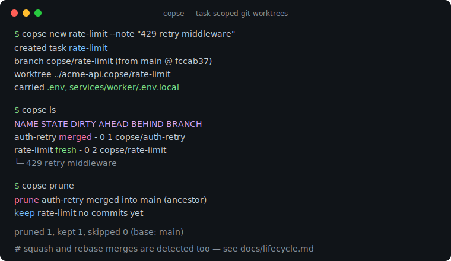
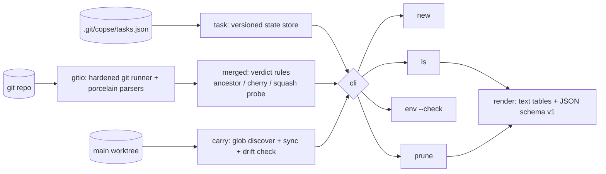

# copse

[English](README.md) | [中文](README.zh.md) | [日本語](README.ja.md)

[](LICENSE) [](go.mod) [](CHANGELOG.md)  [](CONTRIBUTING.md)

**copse：タスク単位の git worktree を管理するオープンソース・ゼロ依存 CLI——名前を付けて作成し、env ファイルを持ち込み、ブランチがマージされた瞬間（squash マージ含む）に刈り取る。**



```bash
git clone https://github.com/JaydenCJ/copse && cd copse
go build -o copse ./cmd/copse    # single static binary, stdlib only
```

> プレリリース：v0.1.0 はまだパッケージレジストリに公開していません。上記のとおりソースからビルドしてください（Go ≥1.22、git ≥2.31）。

## なぜ copse？

並列 AI コーディングエージェントの普及で `git worktree` は日常の道具になりました。1 つのリポジトリで 5 つのチェックアウトを同時に開き、それぞれ別ブランチというのが普通です。痛みは worktree の*作成*にはありません——`git worktree add` で足りるし、あいまい検索で cd するシェルスクリプトも山ほどあります。痛いのは**ライフサイクル**です。`.env` は gitignore されているので、新しい worktree は秘密情報を手コピーするまで壊れたまま起動し——ローテーション後は古い値を黙って使い続けます。ブランチが取り込まれた後も worktree は居座り続けます。squash マージのたびに `git branch -d` は *"not fully merged"* と言い張るので、死んだチェックアウトとブランチが積み上がり、やがて 5 つのディレクトリのどれが何なのか分からなくなります。copse が管理するのはまさにこのライフサイクルです。`new` はタスクに名前・ブランチ・worktree・env ファイルを一発で与え、`ls` はタスクごとのマージ/ダーティ状態を示し、`env --check` は秘密情報のドリフトを捕まえ、`prune` は祖先関係・パッチ等価・squash プローブで着地を検証してから worktree・ブランチ・状態をまとめて削除します。

| | copse | git worktree（標準） | 切替スクリプト（wt、gwq など） | 使い捨てクローン |
|---|---|---|---|---|
| メモと状態を持つタスク名付き worktree | ✅ | ❌ パスのみ | 一部 | ❌ |
| 未追跡の .env ファイルを新チェックアウトへ持ち込み | ✅ | ❌ | ❌ | ❌ |
| ローテーション後の再同期 + ドリフト検査 | ✅ | ❌ | ❌ | ❌ |
| squash/rebase マージをマージ済みとして検出 | ✅ | ❌ | ❌ | ❌ |
| 一コマンドで掃除：worktree + ブランチ + 状態 | ✅ | ❌ 手動 2 手順 | ❌ | ❌ |
| ダーティ・未マージの作業の破壊を拒否 | ✅ | 一部 | ❌ | ❌ |
| ランタイム依存 | 0 | 0（標準） | shell + fzf 等 | 該当なし |

<sub>依存の主張は 2026-07-12 に確認：copse が import するのは Go 標準ライブラリのみ。外部インターフェースはローカルの `git` バイナリただ一つ。ネットワークもテレメトリも一切なし。</sub>

## 特徴

- **1 タスク 1 コマンド** — `copse new rate-limit` がブランチ（`copse/rate-limit`）を切り、worktree（`../<repo>.copse/rate-limit`）を作り、env ファイルをコピーし、メモを記録。どのチェックアウトが何かを常に把握できます。
- **env は持ち込む、腐らせない** — 任意の深さの gitignore 済み `.env` / `.env.*` が新しい worktree に必ず付いてくる。ローテーション後に古くなったタスクは `copse env --check` が終了コード 1 で警告し、`copse env --all` が林全体をまとめて修復。
- **正直なマージ検出** — prune はタスクごとに根拠を引用：マージコミットは `merged into main (ancestor)`、rebase マージは `(every commit patch-equivalent)`、squash マージは `git cherry` で検証可能な無参照のブランチ全体プローブコミットにより `(squash)`。
- **作業を絶対に食わない** — 新規タスク（コミットなし）は決して刈らず、ダーティな worktree は `--force` なしではスキップ。エージェントが残した未追跡ファイルはダーティ扱い、持ち込んだ env ファイルは対象外。`rm` は未マージのコミット削除を拒否。
- **スクリプトのために設計** — `--porcelain` と `copse path` はエージェント/tmux/コンテナ向けに素のパスを出力。`ls` と `prune` は安定 JSON（`schema_version: 1`）を出し、終了コードは契約：0 正常、1 ドリフト、2 用法エラー、3 実行時エラー。
- **設定は git の中に** — リポジトリごとに `git config copse.root / copse.branchprefix / copse.base / copse.carry`。状態は `.git/copse/tasks.json` にあり、全 worktree で共有、コミットは一切されない。
- **ゼロ依存・完全オフライン** — Go 標準ライブラリのみ。どのリポジトリでも動き、デーモンなし、シェルフックなし、何も listen しない。

## クイックスタート

```bash
cd acme-api                # your repo, .env already in place (and gitignored)
copse new rate-limit --note "429 retry middleware"
```

実際にキャプチャした出力：

```text
created task rate-limit
  branch    copse/rate-limit  (from main @ fccab37)
  worktree  ../acme-api.copse/rate-limit
  carried   .env, services/worker/.env.local
```

一週間後——タスクが 1 つマージされ、秘密情報もローテーション済み（`copse ls`、実出力）：

```text
copse — 2 tasks in acme-api (base: main)

NAME        STATE   DIRTY  AHEAD  BEHIND  BRANCH            PATH
auth-retry  merged  -          0       1  copse/auth-retry  ../acme-api.copse/auth-retry
rate-limit  fresh   -          0       2  copse/rate-limit  ../acme-api.copse/rate-limit
  └─ 429 retry middleware
```

env のドリフトを捕まえてから掃除（`copse env --check`、`copse prune`、実出力）：

```text
env rate-limit — drift in 1 of 2 files
  stale    .env
  ok       services/worker/.env.local
```

```text
prune  auth-retry  merged into main (ancestor)
keep   rate-limit  no commits yet

pruned 1, kept 1, skipped 0 (base: main)
```

## CLI リファレンス

`copse [-C dir] <command>` —— 素の `copse` は `ls` と同じ。終了コード：0 正常、1 ドリフト検出（`env --check`）、2 用法エラー、3 実行時エラー。

| コマンド | 主なフラグ | 効果 |
|---|---|---|
| `new <task>` | `--note`、`--carry`、`--no-carry`、`--branch`、`--from`、`--base`、`--porcelain` | ブランチ + worktree + env 持ち込み + 状態を一手で |
| `ls` | `--format json`、`--base` | タスク表：状態、ダーティ、ahead/behind、メモ |
| `env <task>` | `--check`、`--all` | 持ち込んだ env を再同期、または検証のみでドリフト時に終了 1 |
| `prune` | `--dry-run`、`--force`、`--gone`、`--keep-branch`、`--format json` | マージ済みタスクを削除：worktree + ブランチ + 状態 |
| `rm <task>` | `--force`、`--keep-branch` | マージ有無を問わずタスクを 1 つ意図的に削除 |
| `path <task>` | — | worktree のパスを出力、`cd "$(copse path x)"` 用 |

## 設定

すべて `git config` 経由でリポジトリごと——copse 独自の設定ファイルはありません。

| キー | 既定値 | 効果 |
|---|---|---|
| `copse.root` | `../<repo>.copse` | タスク worktree を置くディレクトリ |
| `copse.branchprefix` | `copse/` | 作成するブランチ名の接頭辞 |
| `copse.base` | origin/HEAD、次いで main/master | マージ判定の基準ブランチ |
| `copse.carry` | `.env`、`.env.*` | 持ち込み glob、複数指定可（`git config --add`） |

## 検証

このリポジトリは CI を一切同梱しません。上記の主張はすべてローカル実行で検証します：

```bash
go test ./...            # 87 deterministic tests, offline, no git config needed
bash scripts/smoke.sh    # full lifecycle end-to-end, prints SMOKE OK
```

## アーキテクチャ



## ロードマップ

- [x] v0.1.0 — 名前付きタスク worktree、env 持ち込みとドリフト検査、祖先/rebase/squash マージ検出、根拠を引用する安全な prune、JSON 出力、テスト 87 件 + smoke スクリプト
- [ ] copse を介さず作られた worktree を取り込む `copse adopt`
- [ ] 作成後フック（`copse.postnew`）でタスクごとに `npm install` / `direnv allow` を実行
- [ ] watch モード：env ファイルの変更を検知して自動同期
- [ ] 経過時間ベースの通知（`ls` が N 日放置のタスクを強調）
- [ ] シェル補完と bash/zsh/fish 向け `cd` ヘルパースニペット

全リストは [open issues](https://github.com/JaydenCJ/copse/issues) を参照。

## コントリビュート

issue・議論・PR を歓迎します——ローカルの手順（フォーマット、vet、テスト、`SMOKE OK`）は [CONTRIBUTING.md](CONTRIBUTING.md) へ。入門向けタスクは [good first issue](https://github.com/JaydenCJ/copse/issues?q=is%3Aissue+is%3Aopen+label%3A%22good+first+issue%22)、設計の話は [Discussions](https://github.com/JaydenCJ/copse/discussions) でどうぞ。

## ライセンス

[MIT](LICENSE)
