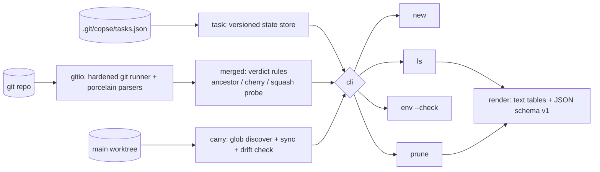

# copse

[English](README.md) | [中文](README.zh.md) | [日本語](README.ja.md)

[](LICENSE) [](go.mod) [](CHANGELOG.md)  [](CONTRIBUTING.md)

**copse：an open-source, zero-dependency CLI for task-scoped git worktrees — create them under a name, carry your env files in, and prune them the moment their branch merges, squash merges included.**


```bash
git clone https://github.com/JaydenCJ/copse && cd copse
go build -o copse ./cmd/copse    # single static binary, stdlib only
```

> Pre-release: v0.1.0 is not tagged on a package registry yet; build from source as above (any Go ≥1.22, git ≥2.31).

## Why copse?

Parallel AI coding agents made `git worktree` mainstream: it is now normal to have five simultaneous checkouts of one repo, each on its own branch. The pain was never *creating* worktrees — `git worktree add` works, and a dozen shell scripts will fuzzy-cd you between them. The pain is the **lifecycle**. Your `.env` files are gitignored, so every new worktree boots a broken app until you hand-copy secrets into it — and silently runs stale ones after a rotation. And once a branch lands, the worktree lingers: `git branch -d` says *"not fully merged"* after every squash merge, so dead checkouts and dead branches pile up until you can't tell which of the five directories is which. copse manages exactly that lifecycle: `new` gives a task a name, a branch, a worktree, and your env files in one command; `ls` shows per-task merge/dirty state; `env --check` catches secret drift; and `prune` verifies — by ancestry, by patch-equivalence, or by a squash probe — that the work truly landed before removing worktree, branch, and state together.

| | copse | git worktree (built-in) | switcher scripts (wt, gwq, …) | scratch clones |
|---|---|---|---|---|
| Task-named worktrees with notes and state | ✅ | ❌ paths only | partial | ❌ |
| Carries untracked .env files into new checkouts | ✅ | ❌ | ❌ | ❌ |
| Re-sync + drift check after secret rotation | ✅ | ❌ | ❌ | ❌ |
| Detects squash/rebase merges as merged | ✅ | ❌ | ❌ | ❌ |
| One-command cleanup: worktree + branch + state | ✅ | ❌ two manual steps | ❌ | ❌ |
| Refuses to destroy dirty or unmerged work | ✅ | partial | ❌ | ❌ |
| Runtime dependencies | 0 | 0 (built-in) | shell + fzf etc. | n/a |

<sub>Dependency claim checked 2026-07-12: copse imports the Go standard library only; its single external interface is your local `git` binary. No network, no telemetry, ever.</sub>

## Features

- **One command per task** — `copse new rate-limit` cuts the branch (`copse/rate-limit`), creates the worktree (`../<repo>.copse/rate-limit`), copies env files in, and records a note so you always know which checkout is which.
- **Env carry, not env decay** — gitignored `.env` / `.env.*` files at any depth follow you into every new worktree; `copse env --check` exits 1 when a rotated secret leaves a task stale, and `copse env --all` repairs the whole grove.
- **Honest merge detection** — prune quotes its evidence per task: `merged into main (ancestor)` for merge commits, `(every commit patch-equivalent)` for rebase merges, `(squash)` via an unreferenced whole-branch probe commit that `git cherry` can verify.
- **Never eats work** — fresh tasks (no commits yet) are never pruned, dirty worktrees are skipped without `--force`, untracked files an agent left behind count as dirty while carried env files do not, and `rm` refuses to delete unmerged commits.
- **Built for scripting** — `--porcelain` and `copse path` print bare paths for agents/tmux/containers, `ls` and `prune` emit stable JSON (`schema_version: 1`), and exit codes are a contract: 0 ok, 1 drift, 2 usage, 3 runtime.
- **Configured where git lives** — `git config copse.root / copse.branchprefix / copse.base / copse.carry` per repo; state sits in `.git/copse/tasks.json`, shared by all worktrees, committed by none.
- **Zero dependencies, fully offline** — Go standard library only; works on any repo, no daemon, no shell hooks, binds to nothing.

## Quickstart

```bash
cd acme-api                # your repo, .env already in place (and gitignored)
copse new rate-limit --note "429 retry middleware"
```

Real captured output:

```text
created task rate-limit
  branch    copse/rate-limit  (from main @ fccab37)
  worktree  ../acme-api.copse/rate-limit
  carried   .env, services/worker/.env.local
```

A week later — one task merged, secrets rotated (`copse ls`, real output):

```text
copse — 2 tasks in acme-api (base: main)

NAME        STATE   DIRTY  AHEAD  BEHIND  BRANCH            PATH
auth-retry  merged  -          0       1  copse/auth-retry  ../acme-api.copse/auth-retry
rate-limit  fresh   -          0       2  copse/rate-limit  ../acme-api.copse/rate-limit
  └─ 429 retry middleware
```

Catch env drift, then clean up (`copse env --check`, `copse prune`, real output):

```text
env rate-limit — drift in 1 of 2 files
  stale    .env
  ok       services/worker/.env.local
```

```text
prune  auth-retry  merged into main (ancestor)
keep   rate-limit  no commits yet

pruned 1, kept 1, skipped 0 (base: main)
```

## CLI reference

`copse [-C dir] <command>` — bare `copse` runs `ls`. Exit codes: 0 ok, 1 drift found (`env --check`), 2 usage error, 3 runtime error.

| Command | Key flags | Effect |
|---|---|---|
| `new <task>` | `--note`, `--carry`, `--no-carry`, `--branch`, `--from`, `--base`, `--porcelain` | branch + worktree + env carry + state, in one step |
| `ls` | `--format json`, `--base` | table of tasks: state, dirty, ahead/behind, notes |
| `env <task>` | `--check`, `--all` | re-sync carried env files, or verify and exit 1 on drift |
| `prune` | `--dry-run`, `--force`, `--gone`, `--keep-branch`, `--format json` | remove every merged task: worktree + branch + state |
| `rm <task>` | `--force`, `--keep-branch` | remove one task deliberately, merged or not |
| `path <task>` | — | print the worktree path, for `cd "$(copse path x)"` |

## Configuration

All via `git config`, per repository — no config files of its own.

| Key | Default | Effect |
|---|---|---|
| `copse.root` | `../<repo>.copse` | directory that holds task worktrees |
| `copse.branchprefix` | `copse/` | prefix for created branch names |
| `copse.base` | origin/HEAD, then main/master | branch merges are measured against |
| `copse.carry` | `.env`, `.env.*` | carry glob, repeatable (`git config --add`) |

## Verification

This repository ships no CI; every claim above is verified by local runs:

```bash
go test ./...            # 87 deterministic tests, offline, no git config needed
bash scripts/smoke.sh    # full lifecycle end-to-end, prints SMOKE OK
```

## Architecture



## Roadmap

- [x] v0.1.0 — named task worktrees, env carry with drift check, ancestor/rebase/squash merge detection, safe prune with quoted evidence, JSON output, 87 tests + smoke script
- [ ] `copse adopt` for worktrees created behind copse's back
- [ ] Post-create hooks (`copse.postnew`) to run `npm install` / `direnv allow` per task
- [ ] Watch mode: auto-sync env files on change instead of on demand
- [ ] Age-based nudges (`ls` highlighting tasks idle for N days)
- [ ] Shell completions and a `cd`-helper snippet for bash/zsh/fish

See the [open issues](https://github.com/JaydenCJ/copse/issues) for the full list.

## Contributing

Issues, discussions and pull requests are welcome — see [CONTRIBUTING.md](CONTRIBUTING.md) for the local workflow (format, vet, tests, `SMOKE OK`). Good entry points are labelled [good first issue](https://github.com/JaydenCJ/copse/issues?q=is%3Aissue+is%3Aopen+label%3A%22good+first+issue%22), and design questions live in [Discussions](https://github.com/JaydenCJ/copse/discussions).

## License

[MIT](LICENSE)
