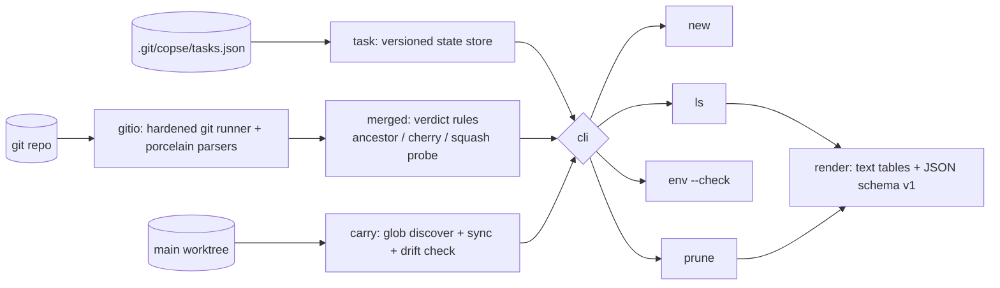

# copse

[English](README.md) | [中文](README.zh.md) | [日本語](README.ja.md)

[](LICENSE) [](go.mod) [](CHANGELOG.md)  [](CONTRIBUTING.md)

**copse：一个开源、零依赖的任务级 git worktree 管理 CLI——按名字创建 worktree、把 env 文件带进去，并在分支合并（包括 squash 合并）的那一刻把它修剪掉。**


```bash
git clone https://github.com/JaydenCJ/copse && cd copse
go build -o copse ./cmd/copse    # single static binary, stdlib only
```

> 预发布提示：v0.1.0 尚未发布到任何包仓库；请按上面的方式从源码构建（Go ≥1.22、git ≥2.31 即可）。

## 为什么选 copse？

并行 AI 编码代理让 `git worktree` 成了主流：同一个仓库同时开五个检出、各占一条分支已是常态。痛点从来不在*创建* worktree——`git worktree add` 够用，模糊跳转的 shell 脚本也有一打。痛点在**生命周期**。`.env` 文件被 gitignore，于是每个新 worktree 起来都是坏的，直到你手工把密钥拷进去——而密钥轮换后它还在悄悄用旧值。分支落地之后 worktree 又赖着不走：每次 squash 合并后 `git branch -d` 都说 *"not fully merged"*，死检出和死分支越积越多，最后你分不清五个目录哪个是哪个。copse 管的正是这段生命周期：`new` 一条命令给任务名字、分支、worktree 和 env 文件；`ls` 展示每个任务的合并/脏状态；`env --check` 抓出密钥漂移；`prune` 先验证工作确实落地——祖先关系、补丁等价或 squash 探针——再把 worktree、分支和状态一起移除。

| | copse | git worktree（内置） | 切换脚本（wt、gwq 等） | 临时克隆 |
|---|---|---|---|---|
| 按任务命名的 worktree，带备注和状态 | ✅ | ❌ 只有路径 | 部分 | ❌ |
| 把未跟踪的 .env 文件带进新检出 | ✅ | ❌ | ❌ | ❌ |
| 密钥轮换后的重同步 + 漂移检查 | ✅ | ❌ | ❌ | ❌ |
| 将 squash/rebase 合并识别为已合并 | ✅ | ❌ | ❌ | ❌ |
| 一条命令清理：worktree + 分支 + 状态 | ✅ | ❌ 要手动两步 | ❌ | ❌ |
| 拒绝销毁脏的或未合并的工作 | ✅ | 部分 | ❌ | ❌ |
| 运行时依赖 | 0 | 0（内置） | shell + fzf 等 | 不适用 |

<sub>依赖声明核对于 2026-07-12：copse 只 import Go 标准库；唯一的外部接口是本机的 `git` 二进制。永不联网、永无遥测。</sub>

## 功能

- **一个任务一条命令** — `copse new rate-limit` 切出分支（`copse/rate-limit`）、创建 worktree（`../<repo>.copse/rate-limit`）、拷入 env 文件并记下备注，你永远知道哪个检出是哪个。
- **env 是带过去，不是烂过去** — 任意深度下被 gitignore 的 `.env` / `.env.*` 会跟进每个新 worktree；密钥轮换后哪个任务变陈旧，`copse env --check` 就以退出码 1 报警，`copse env --all` 一次修好整片林子。
- **诚实的合并检测** — prune 为每个任务引用证据：合并提交是 `merged into main (ancestor)`，rebase 合并是 `(every commit patch-equivalent)`，squash 合并则通过一个可被 `git cherry` 验证的无引用整分支探针提交给出 `(squash)`。
- **绝不吃掉工作** — 全新任务（还没有提交）永不被修剪，脏 worktree 没有 `--force` 就跳过，代理遗落的未跟踪文件算脏而带入的 env 文件不算，`rm` 拒绝删除未合并的提交。
- **为脚本而生** — `--porcelain` 和 `copse path` 输出裸路径供代理/tmux/容器使用，`ls` 与 `prune` 输出稳定 JSON（`schema_version: 1`），退出码即契约：0 正常、1 漂移、2 用法错误、3 运行时错误。
- **配置就放在 git 里** — 每仓库 `git config copse.root / copse.branchprefix / copse.base / copse.carry`；状态存于 `.git/copse/tasks.json`，所有 worktree 共享、绝不提交。
- **零依赖、完全离线** — 只用 Go 标准库；任何仓库都能用，无守护进程、无 shell 钩子、不监听任何端口。

## 快速上手

```bash
cd acme-api                # your repo, .env already in place (and gitignored)
copse new rate-limit --note "429 retry middleware"
```

真实捕获的输出：

```text
created task rate-limit
  branch    copse/rate-limit  (from main @ fccab37)
  worktree  ../acme-api.copse/rate-limit
  carried   .env, services/worker/.env.local
```

一周之后——一个任务已合并、密钥已轮换（`copse ls`，真实输出）：

```text
copse — 2 tasks in acme-api (base: main)

NAME        STATE   DIRTY  AHEAD  BEHIND  BRANCH            PATH
auth-retry  merged  -          0       1  copse/auth-retry  ../acme-api.copse/auth-retry
rate-limit  fresh   -          0       2  copse/rate-limit  ../acme-api.copse/rate-limit
  └─ 429 retry middleware
```

抓出 env 漂移，然后清理（`copse env --check`、`copse prune`，真实输出）：

```text
env rate-limit — drift in 1 of 2 files
  stale    .env
  ok       services/worker/.env.local
```

```text
prune  auth-retry  merged into main (ancestor)
keep   rate-limit  no commits yet

pruned 1, kept 1, skipped 0 (base: main)
```

## CLI 参考

`copse [-C dir] <command>` —— 裸 `copse` 等价于 `ls`。退出码：0 正常，1 发现漂移（`env --check`），2 用法错误，3 运行时错误。

| 命令 | 关键 flag | 作用 |
|---|---|---|
| `new <task>` | `--note`、`--carry`、`--no-carry`、`--branch`、`--from`、`--base`、`--porcelain` | 分支 + worktree + env 携带 + 状态，一步完成 |
| `ls` | `--format json`、`--base` | 任务表格：状态、脏标记、领先/落后、备注 |
| `env <task>` | `--check`、`--all` | 重同步携带的 env 文件，或只校验并在漂移时退出 1 |
| `prune` | `--dry-run`、`--force`、`--gone`、`--keep-branch`、`--format json` | 移除每个已合并任务：worktree + 分支 + 状态 |
| `rm <task>` | `--force`、`--keep-branch` | 主动移除单个任务，不论是否已合并 |
| `path <task>` | — | 打印 worktree 路径，供 `cd "$(copse path x)"` |

## 配置

全部通过 `git config`、按仓库生效——copse 自己没有配置文件。

| 键 | 默认值 | 作用 |
|---|---|---|
| `copse.root` | `../<repo>.copse` | 存放任务 worktree 的目录 |
| `copse.branchprefix` | `copse/` | 新建分支名的前缀 |
| `copse.base` | origin/HEAD，其次 main/master | 衡量合并所参照的分支 |
| `copse.carry` | `.env`、`.env.*` | 携带 glob，可多次设置（`git config --add`） |

## 验证

本仓库不带任何 CI；上面的每一条声明都由本地运行验证：

```bash
go test ./...            # 87 deterministic tests, offline, no git config needed
bash scripts/smoke.sh    # full lifecycle end-to-end, prints SMOKE OK
```

## 架构



## 路线图

- [x] v0.1.0 — 命名任务 worktree、env 携带与漂移检查、祖先/rebase/squash 合并检测、带引用证据的安全 prune、JSON 输出、87 个测试 + smoke 脚本
- [ ] `copse adopt`，收编绕过 copse 创建的 worktree
- [ ] 创建后钩子（`copse.postnew`），按任务运行 `npm install` / `direnv allow`
- [ ] watch 模式：env 文件变化时自动同步，而非按需触发
- [ ] 基于时长的提醒（`ls` 高亮闲置 N 天的任务）
- [ ] shell 补全以及 bash/zsh/fish 的 `cd` 辅助片段

完整列表见 [open issues](https://github.com/JaydenCJ/copse/issues)。

## 贡献

欢迎 issue、讨论与 PR——本地工作流（格式化、vet、测试、`SMOKE OK`）见 [CONTRIBUTING.md](CONTRIBUTING.md)。入门任务标注在 [good first issue](https://github.com/JaydenCJ/copse/issues?q=is%3Aissue+is%3Aopen+label%3A%22good+first+issue%22)，设计讨论请到 [Discussions](https://github.com/JaydenCJ/copse/discussions)。

## 许可证

[MIT](LICENSE)
